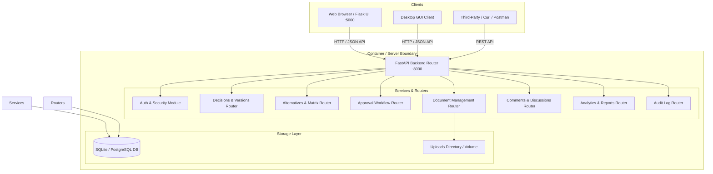

# Expert Decision Replay Platform 🎯

> **Centralized Enterprise Platform for Recording, Replaying, Governance, and Intelligence of Organizational Decisions.**

---

## 📋 Table of Contents
1. [Project Description](#-project-description)
2. [Key Features](#-key-features)
3. [Technology Stack](#-technology-stack)
4. [System Architecture](#-system-architecture)
5. [Prerequisites](#-prerequisites)
6. [Installation & Local Setup](#-installation--local-setup)
7. [Environment Variables](#-environment-variables)
8. [Database Configuration & Pre-seeded Accounts](#-database-configuration--pre-seeded-accounts)
9. [Running the Application](#-running-the-application)
10. [API Documentation & Reference](#-api-documentation--reference)
11. [Docker Deployment Guide](#-docker-deployment-guide)
12. [Production Deployment & CORS](#-production-deployment--cors)
13. [Testing Evidence & Quality Assurance](#-testing-evidence--quality-assurance)
14. [Team Members](#-team-members)
15. [Future Improvements](#-future-improvements)

---

## 📖 Project Description

The **Expert Decision Replay Platform** solves a critical enterprise challenge: **tribal knowledge loss and invisible decision rationale**. 

When engineering, product, or executive leadership makes architectural or strategic choices (e.g. migrating database infrastructure, adopting Kubernetes, choosing cloud providers), the context, alternatives evaluated, trade-offs analyzed, and approval trail are frequently lost in chat transcripts or lost documents.

This platform provides a centralized, audited system to:
- **Record Decisions**: Capture problem statements, meeting summaries, conclusions, and next actions.
- **Compare Alternatives**: Quantify cost, feasibility (1-5), and risk (1-5) ratings with explicit pros, cons, and risk mitigation plans.
- **Enforce Governance**: Run multi-level sequential approvals with role-based permissions (Administrator, Manager, Reviewer, Employee).
- **Track Complete History**: Automatically snapshot versions on every modification and preserve immutable audit logs.
- **Analytics & Report Accuracy**: Generate accurate real-time dashboards and export compliance data directly to Excel and PDF formats.

---

## ⚡ Key Features

- **🔒 Authentication & Security**: JWT OAuth2 authentication with bcrypt password hashing, input validation, and role-based access control (RBAC).
- **👥 User & Team Management**: Assign users to specialized roles (`Administrator`, `Manager`, `Reviewer`, `Employee`) across departments (`Engineering`, `Product`, `Operations`, `Legal`, etc.).
- **📌 Decision Workspace**: Create, view, edit, filter, search, and delete decisions across lifecycle statuses (`Draft`, `Under Review`, `Approved`, `Rejected`, `Archived`).
- **⚖️ Alternative Comparison**: Multi-factor decision matrix comparing alternatives side-by-side with risk/feasibility indicators and cost aggregation.
- **📁 Document Management**: Secure upload, preview, download, and deletion of PDF, DOCX, XLSX, PNG, and JPG attachments with file extension validation and 10MB size limits.
- **💬 Threaded Discussions**: Comment threads with nested replies and user attribution.
- **📜 Automatic Version Control**: Every title, problem statement, or alternative edit creates an incremental snapshot in `decision_versions`.
- **✍️ Multi-Level Approvals**: Assign sequential approval levels with real-time status transitions (`Pending`, `Approved`, `Rejected`) and comment records.
- **🔔 Real-time Notifications**: Automated notification dispatches when reviews are requested, approved, rejected, or commented on.
- **🛡️ Immutable Audit Logging**: High-resolution audit trail of logins, CRUD operations, document uploads, and exports with IP logging.
- **📊 Verified Analytics & Reports**: Real-time summary statistics, status breakdown charts, team metrics, and verified DB-matched reporting.

---

## 🛠️ Technology Stack

| Layer | Technology | Details |
| :--- | :--- | :--- |
| **Backend API** | FastAPI (Python 3.12) | High-performance async REST API with Pydantic v2 validation |
| **Database & ORM** | SQLite / PostgreSQL + SQLAlchemy 2.0 | Declarative ORM models with relationship cascades & migrations |
| **Web Frontend** | Flask (Python 3.12) + HTML5 / CSS3 / JS | Dark glassmorphism UI with Bootstrap 5 & Chart.js |
| **Desktop Client** | Python PySide6 / Tkinter GUI | Desktop application for quick decision lookup and approval tasks |
| **Authentication** | OAuth2 + JWT (python-jose, PassLib) | Bearer token authentication & role authorization |
| **Reporting & Export** | Pandas + OpenPyXL | Excel spreadsheet generation and streaming responses |
| **Containerization** | Docker & Docker Compose | Multi-container architecture with network & volume orchestration |
| **Test Suite** | Pytest + FastAPI TestClient | Comprehensive automated integration and unit testing |

---

## 🏗️ System Architecture



---

## 📋 Prerequisites

- **Python 3.11+** installed (`python --version`)
- **Git** version control
- **Docker & Docker Compose** (Optional, for containerized execution)

---

## ⚙️ Environment Variables

Copy `.env.example` to `.env` or set environment variables in your environment:

```ini
# Server Settings
PORT=8000
HOST=0.0.0.0
PROJECT_NAME="Expert Decision Replay Platform"
API_V1_STR="/api/v1"

# Security
SECRET_KEY="supersecretkeyforjwttokengenerationthatisverylong123456"
ALGORITHM="HS256"
ACCESS_TOKEN_EXPIRE_MINUTES=480

# Database
DATABASE_URL="sqlite:///./decisions.db"

# Storage & File Limits
UPLOAD_DIR="./uploads"
MAX_FILE_SIZE_BYTES=10485760

# Frontend Settings
FLASK_PORT=5000
BACKEND_API_URL="http://127.0.0.1:8000/api/v1"
```

---

## 🗄️ Database Configuration & Pre-seeded Accounts

The application automatically creates required SQLite database tables (`decisions.db`) on boot and seeds initial testing accounts:

| Role | Email | Password | Assigned Team |
| :--- | :--- | :--- | :--- |
| **Administrator** | `admin@company.com` | `AdminPassword123` | IT Operations |
| **Manager** | `manager@company.com` | `ManagerPassword123` | Engineering Management |
| **Reviewer** | `reviewer@company.com` | `ReviewerPassword123` | Technical Architecture |
| **Employee** | `employee@company.com` | `EmployeePassword123` | Frontend Team |

---

## 🚀 Running the Application

### Option 1: Unified Local Platform Runner (Recommended)

1. Install Python dependencies:
   ```bash
   pip install -r requirements.txt
   ```

2. Launch all components (Backend, Web UI, Desktop GUI, Browser):
   ```bash
   python run_platform.py
   ```

3. Access endpoints:
   - **Web UI Application**: [http://127.0.0.1:5000](http://127.0.0.1:5000)
   - **REST API Swagger Docs**: [http://127.0.0.1:8000/docs](http://127.0.0.1:8000/docs)
   - **OpenAPI JSON Schema**: [http://127.0.0.1:8000/openapi.json](http://127.0.0.1:8000/openapi.json)

### Option 2: Running Backend & Frontend Separately

- **Backend FastAPI Service**:
  ```bash
  uvicorn backend.app.main:app --host 127.0.0.1 --port 8000 --reload
  ```

- **Frontend Web UI Service**:
  ```bash
  python frontend_web/app/main.py
  ```

- **Desktop GUI Client**:
  ```bash
  python frontend_desktop/desktop_app.py
  ```

---

## 📡 API Documentation & Reference

The API is fully documented via interactive Swagger UI at `http://127.0.0.1:8000/docs`. Key endpoint groupings:

| Module | Method | Endpoint | Description | Auth Required |
| :--- | :--- | :--- | :--- | :--- |
| **Auth** | `POST` | `/api/v1/users/register` | Register new user account | No |
| **Auth** | `POST` | `/api/v1/users/login` | Authenticate user & get JWT token | No |
| **Users** | `GET` | `/api/v1/users/me` | Fetch current authenticated profile | Yes |
| **Users** | `GET` | `/api/v1/users/` | List all system users | Admin |
| **Decisions** | `POST` | `/api/v1/decisions/` | Create a new decision record | Yes |
| **Decisions** | `GET` | `/api/v1/decisions/` | List & filter all decisions | Yes |
| **Decisions** | `GET` | `/api/v1/decisions/{id}` | Get detailed decision + versions + alternatives | Yes |
| **Decisions** | `PUT` | `/api/v1/decisions/{id}` | Update decision (triggers version snapshot) | Yes |
| **Alternatives** | `POST` | `/api/v1/decisions/{id}/alternatives` | Add alternative to decision | Yes |
| **Alternatives** | `PUT` | `/api/v1/alternatives/{id}` | Update alternative details | Yes |
| **Approvals** | `POST` | `/api/v1/decisions/{id}/submit-review` | Submit decision for review | Yes |
| **Approvals** | `POST` | `/api/v1/approvals/{id}/action` | Action pending review (Approve/Reject) | Yes |
| **Documents** | `POST` | `/api/v1/documents/upload` | Upload PDF/Docx/Xlsx file | Yes |
| **Documents** | `DELETE` | `/api/v1/documents/{id}` | Delete document attachment | Yes |
| **Comments** | `POST` | `/api/v1/decisions/{id}/comments` | Post discussion comment or reply | Yes |
| **Analytics** | `GET` | `/api/v1/analytics/dashboard` | Real-time aggregate statistics & charts | Yes |
| **Reports** | `GET` | `/api/v1/reports/decisions` | Detailed decision report breakdown | Manager/Admin |
| **Reports** | `GET` | `/api/v1/reports/export/excel` | Export system data to Excel spreadsheet | Manager/Admin |
| **Audit** | `GET` | `/api/v1/analytics/audit-logs` | Immutable audit log trail | Manager/Admin |

---

## 🐳 Docker Deployment Guide

The platform contains complete Docker containerization for production deployment:

### 1. Build and Run Container Stack
```bash
docker-compose up --build -d
```

### 2. Verify Running Containers
```bash
docker-compose ps
```

### 3. Container Services & Network Exposure
- **Backend Container (`decision_replay_backend`)**: Port `8000`
- **Web Frontend Container (`decision_replay_frontend`)**: Port `5000`
- **Persistent Volumes**: `backend_db` (database persistence) and `shared_uploads` (uploaded documents persistence).

### 4. Stopping Containers
```bash
docker-compose down
```

---

## 🌐 Production Deployment & CORS

To deploy to production environments (AWS EC2, Render, DigitalOcean, Heroku, Azure App Services):

1. **Set Environment Variables**: Provide `SECRET_KEY`, `DATABASE_URL` (PostgreSQL recommended), and `BACKEND_API_URL` pointing to your deployed domain.
2. **CORS Middleware Configuration**: Configure `CORSMiddleware` origins in `backend/app/main.py` to allow your deployed frontend origin URL.
3. **Static File Upload Volume**: Ensure persistent storage volume is attached to `/app/uploads`.

---

## 🧪 Testing Evidence & Quality Assurance

The platform is covered by an automated test suite verifying functionality across all 12 platform modules:

```bash
pytest test_api.py -v
```

### Verified Test Categories:
- **Authentication**: Registration, Login, Invalid Password (HTTP 401), Invalid Email format (422), Empty Field validation (422), JWT security.
- **User & Roles**: User creation, Profile update, Role assignment, RBAC access control.
- **Decision Management**: Creation with validation, Update, Delete, Status transitions.
- **Alternatives**: Alternative CRUD, Risk/Feasibility ratings, side-by-side comparison matrix.
- **Document Storage**: Upload PDF/DOCX/XLSX/PNG/JPG, Download, Delete, Disallowed extension rejection (`.txt`), Large file rejection (>10MB).
- **Discussions**: Root comments, Nested replies, Editing, Deleting comments.
- **Version Tracking**: Automatic snapshot generation and incremental versioning on updates.
- **Approval Workflows**: Submit for review, Approve, Reject, Approval trail history.
- **Notifications**: Automatic notification dispatches and read state tracking.
- **Audit Logs**: Action recording on CRUD/logins, Audit log immutability (HTTP 403 on edit/delete attempts).
- **Reports & Dashboard DB Accuracy**: **100% strict verification comparing dashboard numbers against raw SQL database queries.**

---

## 👥 Team Members

- **Padmashree** - Lead System Architect & Developer

---

## 🔮 Future Improvements

1. **AI Decision Advisor**: Integrate LLM decision analysis to suggest risk mitigations and highlight missing trade-offs.
2. **SSO / SAML Integration**: Enterprise Single Sign-On integration (Okta, Azure AD, OAuth2 Provider).
3. **Advanced Notification Channels**: Email (SMTP/SendGrid) and Slack/Microsoft Teams webhooks.
4. **Full Text Search Indexing**: Elasticsearch / PostgreSQL FTS for instant search across documents and decision histories.
