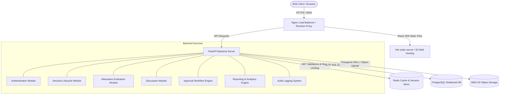
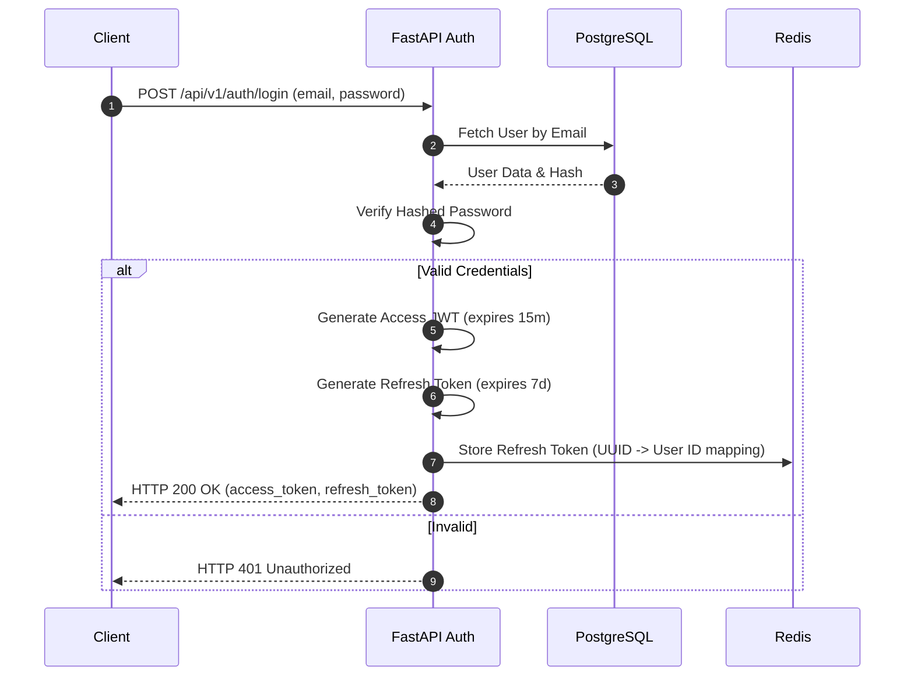

# System Architecture & Design - Expert Decision Replay Platform (EDRP)

* **File Name:** `architecture_design.md`
* **Folder Location:** `docs/architecture/`
* **Purpose:** Define high-level and low-level design structures, clean architecture layers, tech stack decisions, and data access strategies.

---

## 1. High-Level Architecture

The Expert Decision Replay Platform (EDRP) is designed as a modular, three-tier web application. Although started as a monolithic service to facilitate rapid development during early phases, the modules are decoupled (clean modular design) to ensure **Microservice Readiness**.



### 1.1 Tiers Description
1. **Presentation Tier:**
   A single-page application (SPA) built with React 19, TypeScript, and Vite. It consumes the REST APIs and connects via WebSockets for real-time notifications.
2. **Application Tier:**
   A stateless FastAPI Python application running inside Uvicorn. It handles routing, middleware, schema validation via Pydantic v2, domain logic, and interaction with data resources.
3. **Data Tier:**
   - **PostgreSQL:** For persistent transactional data (Users, Decisions, Alternatives, Approvals, Comments, Audits).
   - **Redis:** For session blacklisting, general object caching (speeding up GET requests), and API rate limiting.
   - **AWS S3:** Object storage for file attachments and exported PDF reports.

---

## 2. Low-Level Architecture & Clean Architecture Layers

To ensure long-term maintainability, the backend codebase implements **Clean Architecture** patterns, decoupling the HTTP transport layers from business models and database logic.

```
+---------------------------------------------------------+
|                  FastAPI Route Handlers                 |  <-- HTTP Requests, Routing, OpenAPI docs
+---------------------------------------------------------+
                            |
                            v
+---------------------------------------------------------+
|                  Pydantic Schemas                       |  <-- Request/Response serialization, validation
+---------------------------------------------------------+
                            |
                            v
+---------------------------------------------------------+
|                  Business Services (Domain)             |  <-- Core logic, workflows, validations
+---------------------------------------------------------+
                            |
                            v
+---------------------------------------------------------+
|               SQLAlchemy Repositories (Data)            |  <-- SQL abstraction, queries, unit of work
+---------------------------------------------------------+
                            |
                            v
+---------------------------------------------------------+
|                  PostgreSQL Database                    |  <-- Raw tables, indexes, constraints
+---------------------------------------------------------+
```

### 2.1 Backend Layers Explanation
1. **Routers (`app/api/v1/endpoints/`)**: Handles entry points, maps URL pathways, extracts parameters, checks route permissions via dependencies, and delegates to service layer.
2. **Schemas (`app/schemas/`)**: Declares input/output Pydantic models. Separates database representations from raw user inputs.
3. **Services (`app/services/`)**: The core business logic layer. Implements business rules (e.g. "An employee cannot approve their own decision", "Trigger notification when alternative is scored"). Knows nothing about HTTP status codes.
4. **Repositories (`app/repositories/`)**: Interfaces with SQLAlchemy models to fetch, update, and persist entities. Encapsulates complex JOIN operations and search filters.
5. **Models (`app/models/`)**: Declarative SQLAlchemy models reflecting the PostgreSQL schema.

### 2.2 Frontend Layers Explanation
The React application follows a modular component structure structured around pages, components, hooks, services, and state management:
* **`src/components/ui/`**: Low-level generic presentation components (Shadcn inputs, buttons, dialogs).
* **`src/features/`**: Feature-grouped modules (e.g., `features/decisions/` contains its own hooks, components, and pages).
* **`src/services/`**: API wrapper clients using Axios.
* **`src/hooks/`**: Custom TanStack Query hooks linking React components with services.
* **`src/context/`**: Global Context states (Auth context, theme context).

---

## 3. Technology Decisions (ADR Summary)

* **Python & FastAPI over Java & Spring Boot:**
  * *Context:* The previous prototype specified Spring Boot.
  * *Decision:* Migrated to FastAPI for faster development velocity, native asynchronous execution support, automatic OpenAPI generation, and lower runtime resource overhead (suitable for containerized micro-infra).
* **PostgreSQL over MySQL:**
  * *Context:* Relational transactional storage required.
  * *Decision:* Selected PostgreSQL due to its superior full-text index capabilities (GIN, vector extensions), advanced JSONB support for storing variable alternative criteria weights, and robust transaction handling.
* **Vite & React 19 over vanilla script options:**
  * *Context:* Frontend SPA tooling.
  * *Decision:* Selected React 19 with Vite to leverage concurrent rendering, component-based layout design, fast Hot Module Replacement (HMR), and a robust ecosystem (Tailwind, Framer Motion).

---

## 4. Folder Structure Explanation

Here is the directory layout for the codebase:

```tree
Expert-Decision-Replay-Platform/
├── backend/
│   ├── alembic/                    # DB migration configurations and versions
│   ├── app/
│   │   ├── api/                    # Route endpoints and dependencies
│   │   │   ├── deps.py             # Auth & DB connection inject dependencies
│   │   │   └── v1/
│   │   │       └── endpoints/      # API endpoints (auth.py, decisions.py, etc.)
│   │   ├── core/                   # Global configuration, security configurations
│   │   │   ├── config.py           # BaseSettings configuration loader
│   │   │   ├── database.py         # SQLAlchemy engine and session setup
│   │   │   └── security.py         # Hashing and JWT helpers
│   │   ├── models/                 # SQLAlchemy DB entities
│   │   ├── schemas/                # Pydantic validation schemas
│   │   ├── repositories/           # DB query helper patterns
│   │   ├── services/               # Business logic code
│   │   └── main.py                 # FastAPI application initializer
│   ├── tests/                      # Pytest suites
│   ├── requirements.txt            # Python runtime dependencies
│   └── Dockerfile                  # Container definition
├── frontend/
│   ├── src/
│   │   ├── assets/                 # Static images, styles
│   │   ├── components/             # Reusable global layout/UI elements
│   │   ├── context/                # Auth, Theme contexts
│   │   ├── features/               # Feature-sliced application code
│   │   │   ├── auth/
│   │   │   ├── decisions/
│   │   │   ├── discussion/
│   │   │   └── admin/
│   │   ├── hooks/                  # Custom React hooks (TanStack query wrappers)
│   │   ├── routes/                 # Navigation definitions
│   │   ├── services/               # Axios API wrappers
│   │   ├── App.tsx                 # Core App mounting point
│   │   └── main.tsx                # React virtual DOM bootstrap
│   ├── package.json                # NPM packages dependencies
│   ├── tailwind.config.js          # Styling configurations
│   ├── tsconfig.json               # TypeScript rules
│   └── Dockerfile                  # Production build server
├── docs/                           # Documentation repository
└── docker-compose.yml              # Local multi-container development setup
```

---

## 5. Security & Flow Operations

### 5.1 Authentication Flow


### 5.2 Authorization Flow
1. Client requests an action (e.g., `PUT /api/v1/decisions/{id}`).
2. `deps.get_current_active_user` extracts and parses JWT from header.
3. FastAPI dependency fetches user from database/cache.
4. Route handler invokes role check: `deps.check_role(["Manager", "Administrator"])`.
5. If user role does not match permissions, FastAPI raises `HTTP 403 Forbidden` immediately.

---

## 6. Caching & Storage Strategy

### 6.1 Redis Caching Pattern
* **Session & Revocations:** Active tokens and blacklisted access tokens (upon logout) are stored with TTLs matching the token lifetimes.
* **Read-heavy Cache:** Approved decisions and metadata schemas are stored in Redis under the key format `decision:approved:{id}`. The cache is invalidated (`DEL`) whenever a decision is deprecated, updated, or deleted.

### 6.2 Object Storage Strategy
* Supporting documents (technical specs, architecture plans, diagrams) are stored in an S3 bucket.
* **Upload:** Frontend requests a presigned upload URL from `POST /api/v1/decisions/upload-url` providing filename and type. Frontend then uploads the file directly to S3, reducing backend bandwidth utilization.
* **Read:** Secure files are kept private. The backend generates temporary presigned download URLs (valid for 15 minutes) when authorized users view the decision details.

---

## 7. Deployment Architecture & Scalability Plan

The EDRP is deployable using a horizontal auto-scaling model:
- **Stateless Application Nodes:** Behind an Nginx or AWS Application Load Balancer (ALB), FastAPI instances scale out based on CPU/Memory usage thresholds.
- **Database Scalability:** PostgreSQL operates with a Primary instance (writes) and secondary Read Replicas. FastAPI reads can be routed to replicas by using a replica connection pool.
- **Static Assets:** The production frontend build is uploaded to an S3 bucket configured for static web hosting and distributed globally via a CloudFront CDN.
