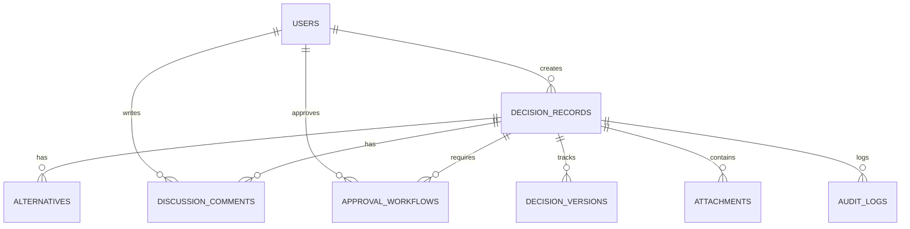

# Database Design & Schema Specification - EDRP

* **File Name:** `database_design.md`
* **Folder Location:** `docs/database/`
* **Purpose:** Define PostgreSQL tables, data types, constraints, index strategy, normalization rules, data dictionary, and database management procedures.

---

## 1. Database Overview

The EDRP application utilizes **PostgreSQL** as its primary relational database management system. Relational structures are used to guarantee strong transactions (ACID properties), which are critical for audit logs, approval workflows, and historical replay tracking.

### 1.1 Database Naming Conventions
- **Tables & Columns:** Snake-case, pluralized table names (e.g., `users`, `decision_records`, `alternatives`).
- **Primary Keys:** Named `id` (UUID format, generated via `uuid-ossp` or Pydantic server-side generator).
- **Foreign Keys:** Named `entity_id` (e.g., `decision_id` referencing `decision_records.id`).
- **Indexes:** Prefixed with `idx_`, followed by table and column names (e.g., `idx_decisions_status`).
- **Foreign Key Constraints:** Prefixed with `fk_`, referencing source and destination (e.g., `fk_alternatives_decision`).

---

## 2. Complete Database Schema (DDL Layout)

Here are the detailed SQL structures and database tables for EDRP.

### 2.1 Table definitions

#### Table: `users`
Represents the system users and authorization credentials.

| Column | Type | Constraints | Description |
| :--- | :--- | :--- | :--- |
| `id` | UUID | PRIMARY KEY, Default: `gen_random_uuid()` | Unique User ID |
| `email` | VARCHAR(255) | UNIQUE, NOT NULL | Corporate login email |
| `hashed_password` | VARCHAR(255) | NOT NULL | Bcrypt hashed password |
| `full_name` | VARCHAR(100) | NOT NULL | User name |
| `role` | VARCHAR(50) | NOT NULL, Check: `role IN ('Employee','Reviewer','Manager','Administrator')` | Role for authorization |
| `is_active` | BOOLEAN | NOT NULL, Default: `TRUE` | Soft disable user flag |
| `created_at` | TIMESTAMP WITH TZ| NOT NULL, Default: `NOW()` | Account creation time |
| `updated_at` | TIMESTAMP WITH TZ| NOT NULL, Default: `NOW()` | Account last update time |

* **Indexes:**
  * `idx_users_email` (B-Tree, Unique) for lookup speed on login.

---

#### Table: `decision_records`
Core decision tracking records.

| Column | Type | Constraints | Description |
| :--- | :--- | :--- | :--- |
| `id` | UUID | PRIMARY KEY, Default: `gen_random_uuid()` | Unique Decision ID |
| `title` | VARCHAR(255) | NOT NULL | Decision title |
| `summary` | TEXT | NOT NULL | Brief summary |
| `context` | TEXT | NOT NULL | Broad background context |
| `problem_statement` | TEXT | NOT NULL | Core problem definition |
| `status` | VARCHAR(50) | NOT NULL, Default: `'Draft'` | Status: Draft, Under Review, Approved, Rejected, Deprecated |
| `category` | VARCHAR(100) | NOT NULL | e.g., Architecture, Financial, Hiring |
| `owner_id` | UUID | FOREIGN KEY REFERENCES `users(id)`, NOT NULL | The creator of the decision |
| `created_at` | TIMESTAMP WITH TZ| NOT NULL, Default: `NOW()` | Timestamp created |
| `updated_at` | TIMESTAMP WITH TZ| NOT NULL, Default: `NOW()` | Timestamp modified |

* **Indexes:**
  * `idx_decisions_status` (B-Tree) for filtering dashboard queues.
  * `idx_decisions_owner` (B-Tree) for listing user decisions.
  * `idx_decisions_fts` (GIN) on columns `title`, `summary`, `context` for full-text search.

---

#### Table: `alternatives`
Proposed options related to a specific decision.

| Column | Type | Constraints | Description |
| :--- | :--- | :--- | :--- |
| `id` | UUID | PRIMARY KEY, Default: `gen_random_uuid()` | Unique Alternative ID |
| `decision_id` | UUID | FOREIGN KEY REFERENCES `decision_records(id)` ON DELETE CASCADE, NOT NULL | Associated decision |
| `name` | VARCHAR(255) | NOT NULL | Option name |
| `description` | TEXT | NOT NULL | Detailed explanation |
| `pros` | TEXT[] | Default: `'{}'` | Array of advantages |
| `cons` | TEXT[] | Default: `'{}'` | Array of disadvantages |
| `score` | NUMERIC(4,2) | Default: `0.00` | System calculated rating |
| `status` | VARCHAR(50) | NOT NULL, Default: `'Proposed'` | Proposed, Selected, Rejected |
| `created_at` | TIMESTAMP WITH TZ| NOT NULL, Default: `NOW()` | Created timestamp |

* **Indexes:**
  * `idx_alternatives_decision` (B-Tree) for resolving list requests.

---

#### Table: `discussion_comments`
Discussion posts inside a decision record.

| Column | Type | Constraints | Description |
| :--- | :--- | :--- | :--- |
| `id` | UUID | PRIMARY KEY | Unique Comment ID |
| `decision_id` | UUID | FOREIGN KEY REFERENCES `decision_records(id)` ON DELETE CASCADE, NOT NULL | Target decision |
| `user_id` | UUID | FOREIGN KEY REFERENCES `users(id)` ON DELETE SET NULL, NOT NULL | Author |
| `parent_comment_id` | UUID | FOREIGN KEY REFERENCES `discussion_comments(id)` ON DELETE CASCADE | Parent ID for nested threads |
| `comment_text` | TEXT | NOT NULL | Raw content (markdown) |
| `created_at` | TIMESTAMP WITH TZ| NOT NULL, Default: `NOW()` | Created timestamp |
| `updated_at` | TIMESTAMP WITH TZ| NOT NULL, Default: `NOW()` | Updated timestamp |

* **Indexes:**
  * `idx_comments_decision` (B-Tree) for loading threads.

---

#### Table: `approval_workflows`
Tracks workflow state transitions and approval logs.

| Column | Type | Constraints | Description |
| :--- | :--- | :--- | :--- |
| `id` | UUID | PRIMARY KEY | Workflow stage ID |
| `decision_id` | UUID | FOREIGN KEY REFERENCES `decision_records(id)` ON DELETE CASCADE, NOT NULL | Associated decision |
| `approver_id` | UUID | FOREIGN KEY REFERENCES `users(id)`, NOT NULL | Reviewer or Manager assigned |
| `stage` | VARCHAR(50) | NOT NULL | e.g., 'Review', 'Final Approval' |
| `status` | VARCHAR(50) | NOT NULL | Pending, Approved, Rejected, Changes Requested |
| `comments` | TEXT | | Approval/rejection commentary |
| `actioned_at` | TIMESTAMP WITH TZ| | When the status was modified |
| `created_at` | TIMESTAMP WITH TZ| NOT NULL, Default: `NOW()` | Assigned time |

---

#### Table: `decision_versions`
Audit snapshots capturing past states of decisions (for "Replay" and history comparisons).

| Column | Type | Constraints | Description |
| :--- | :--- | :--- | :--- |
| `id` | UUID | PRIMARY KEY | Snap version ID |
| `decision_id` | UUID | FOREIGN KEY REFERENCES `decision_records(id)` ON DELETE CASCADE, NOT NULL | Parent decision |
| `version_number` | INTEGER | NOT NULL | Incremental counter (1, 2, 3...) |
| `serialized_data` | JSONB | NOT NULL | JSON snapshot of decision + alternatives |
| `changed_by` | UUID | FOREIGN KEY REFERENCES `users(id)` | User who made change |
| `change_summary` | VARCHAR(255) | NOT NULL | Human-readable explanation of edits |
| `created_at` | TIMESTAMP WITH TZ| NOT NULL, Default: `NOW()` | Creation time |

* **Indexes:**
  * `idx_versions_decision` (B-Tree) for loading version history list.

---

#### Table: `attachments`
Linked S3 files uploaded as evidence.

| Column | Type | Constraints | Description |
| :--- | :--- | :--- | :--- |
| `id` | UUID | PRIMARY KEY | Unique ID |
| `decision_id` | UUID | FOREIGN KEY REFERENCES `decision_records(id)` ON DELETE CASCADE | Associated decision |
| `file_name` | VARCHAR(255) | NOT NULL | Original filename |
| `s3_key` | VARCHAR(512) | NOT NULL | S3 storage key path |
| `file_size` | INTEGER | NOT NULL | File size in bytes |
| `mime_type` | VARCHAR(100) | NOT NULL | e.g. application/pdf |
| `uploaded_by` | UUID | FOREIGN KEY REFERENCES `users(id)` | Uploader ID |
| `created_at` | TIMESTAMP WITH TZ| NOT NULL, Default: `NOW()` | Upload timestamp |

---

#### Table: `audit_logs`
Immutable compliance tracking system events.

| Column | Type | Constraints | Description |
| :--- | :--- | :--- | :--- |
| `id` | BIGSERIAL | PRIMARY KEY | Auto-increment index |
| `user_id` | UUID | FOREIGN KEY REFERENCES `users(id)` ON DELETE SET NULL | Executor of action |
| `action` | VARCHAR(100) | NOT NULL | e.g., LOGIN, CREATE_DECISION, APPROVE_DECISION |
| `table_name` | VARCHAR(100) | NOT NULL | Target table modified |
| `record_id` | UUID | | UUID of changed record |
| `old_values` | JSONB | | Values before operation |
| `new_values` | JSONB | | Values after operation |
| `ip_address` | VARCHAR(45) | | Network origin IP |
| `created_at` | TIMESTAMP WITH TZ| NOT NULL, Default: `NOW()` | Immutable insert time |

* **Indexes:**
  * `idx_audit_created` (B-Tree) for logs query speed.
  * `idx_audit_user` (B-Tree) for filtering activity by staff.

---

## 3. Database Normalization Analysis
The EDRP schema is designed to conform to **Third Normal Form (3NF)**:
* **First Normal Form (1NF):** All tables contain only atomic values. There are no repeating groups. Arrays (like `pros` and `cons` inside `alternatives`) are used for simple list elements, avoiding sub-table overhead where structured analysis is not needed.
* **Second Normal Form (2NF):** Every table has a primary key (UUID or BigSerial), and all non-key attributes are fully functionally dependent on the entire primary key.
* **Third Normal Form (3NF):** No transitive dependencies exist. For example, user names and roles are stored strictly in `users`, and decisions reference the user via foreign keys rather than duplicating user detail fields.

---

## 4. Migration & Backup Strategy

### 4.1 Database Migrations (Alembic)
1. Developers define or update schema models in `backend/app/models/`.
2. Generate schema changes using:
   `alembic revision --autogenerate -m "Add decision versioning"`
3. Verify the generated script inside `backend/alembic/versions/` for safety.
4. Run migrations on server startup or deployment script:
   `alembic upgrade head`

### 4.2 Backup Strategy
- **Backup Window:** Scheduled daily at 02:00 AM UTC (low traffic period) via cron jobs/AWS Backup.
- **Backup Type:** Logical backups using `pg_dump` compressed format for point-in-time recoveries.
- **Storage:** Exported backups are zipped, AES-256 encrypted, and stored in a secure S3 bucket with a 30-day lifecycle expiration policy (transitioning to S3 Glacier Deep Archive).
