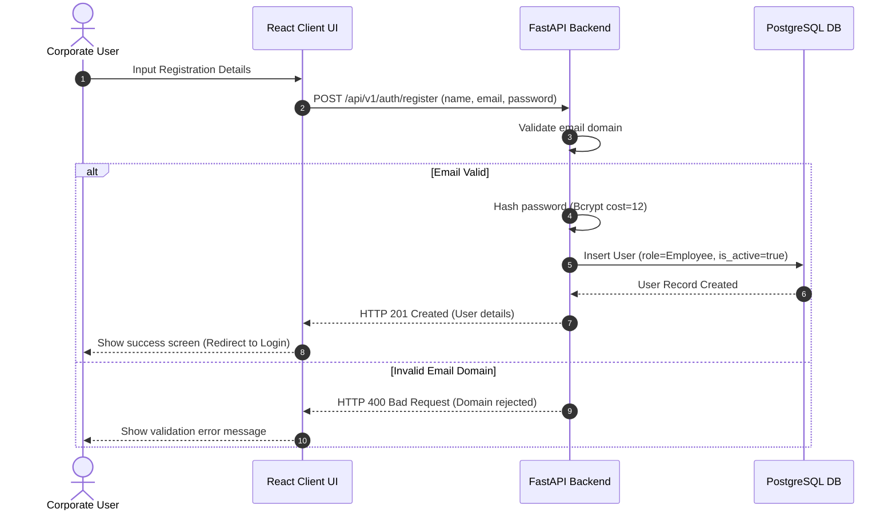
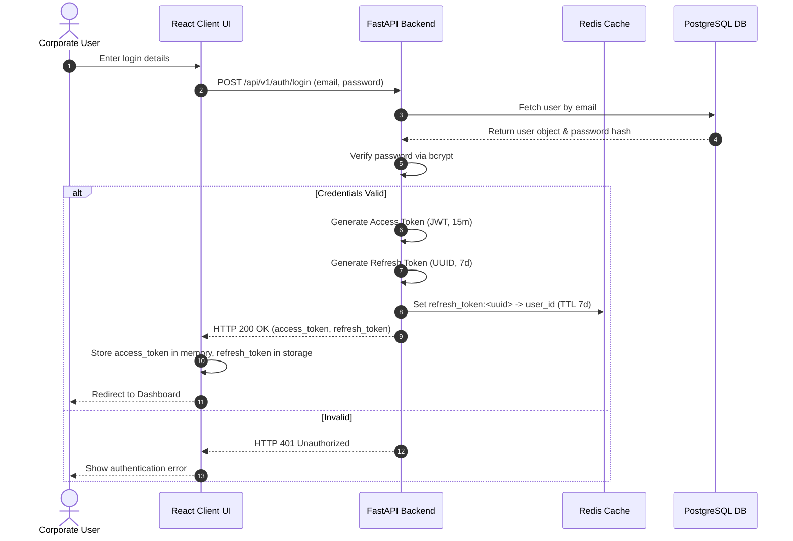
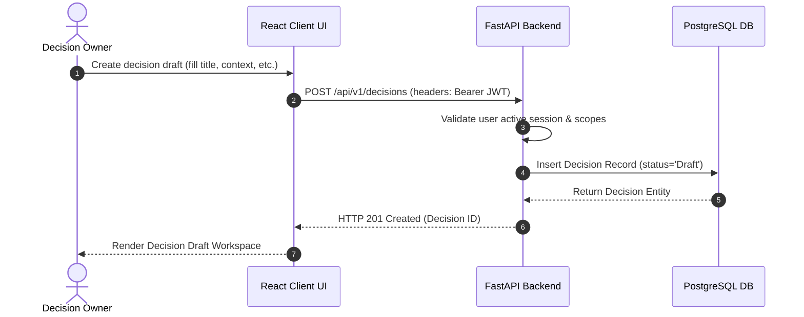
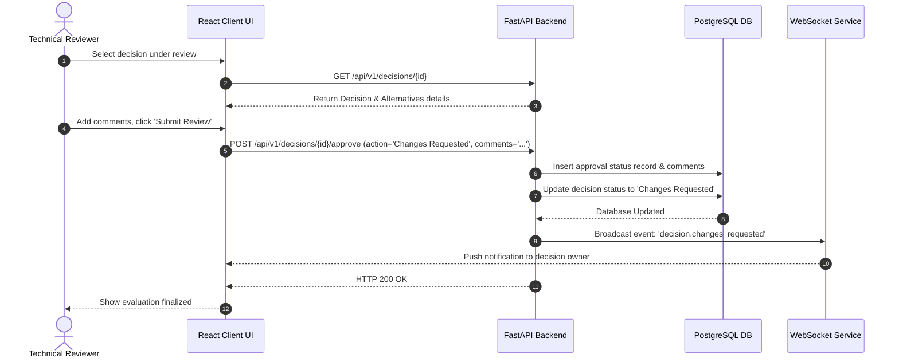
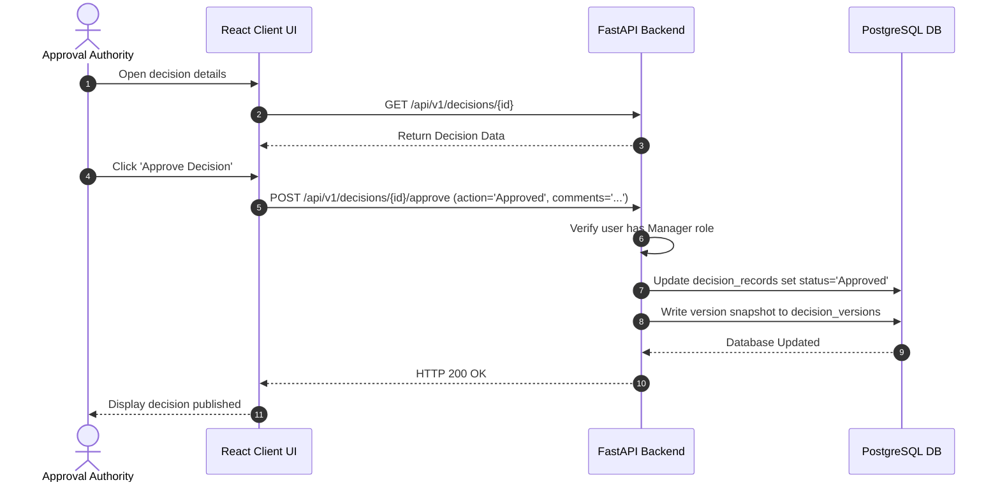
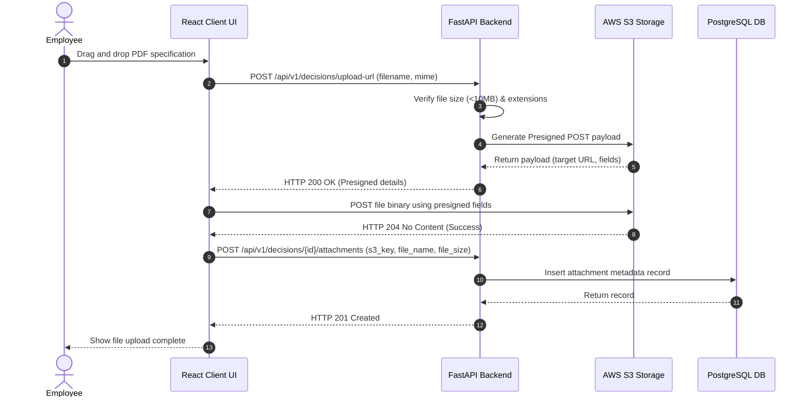
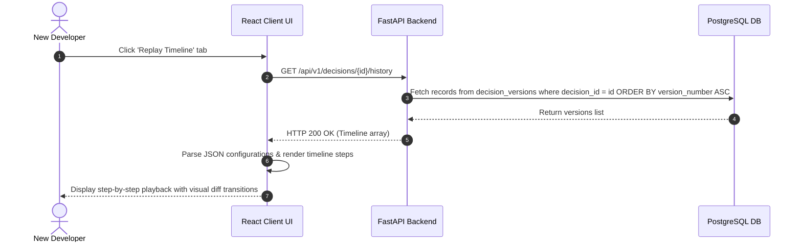
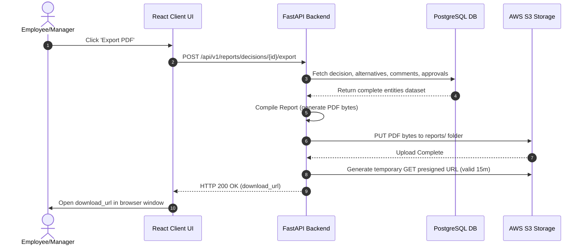

# Sequence Diagrams Specification - EDRP

* **File Name:** `sequence_diagrams.md`
* **Folder Location:** `docs/diagrams/`
* **Purpose:** Detail interaction sequences between the Client UI, Backend API, Database, and S3 Storage using Mermaid.

---

## 1. User Registration & Onboarding Sequence

---

## 2. User Authentication Sequence

---

## 3. Decision Creation Sequence

---

## 4. Decision Review Pipeline Sequence

---

## 5. Manager Approval Sequence

---

## 6. Document Upload Sequence (S3 Presigned)

---

## 7. Chronological Decision Replay Sequence

---

## 8. Report Generation (PDF Export) Sequence

