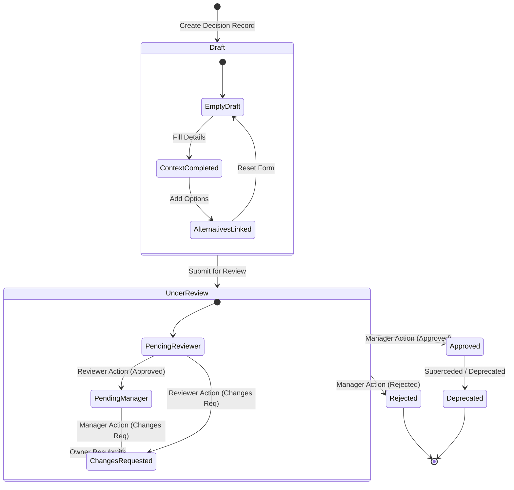
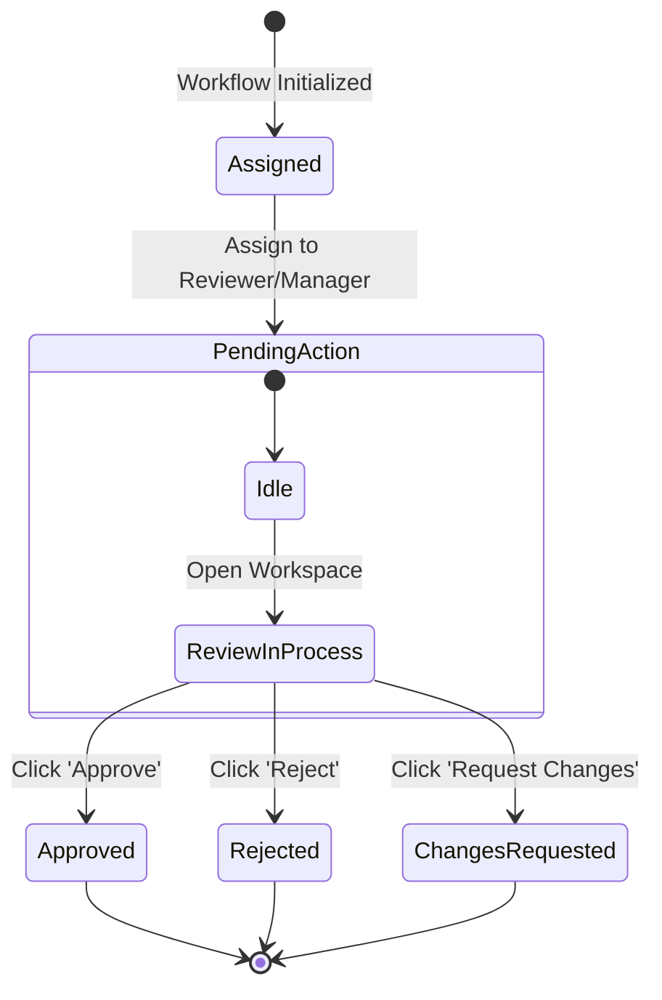
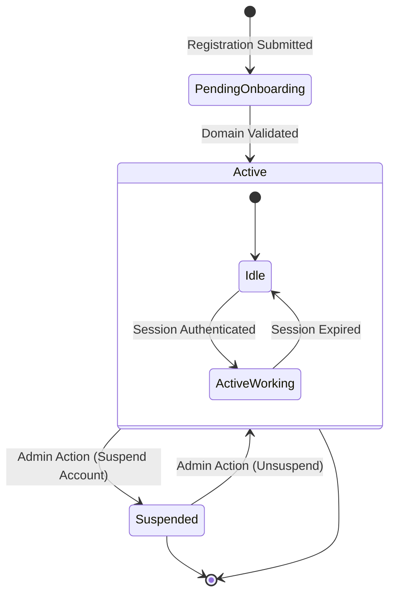
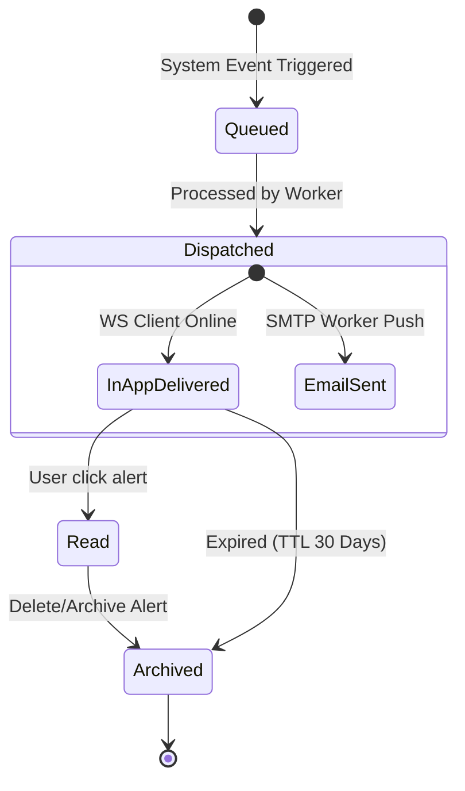
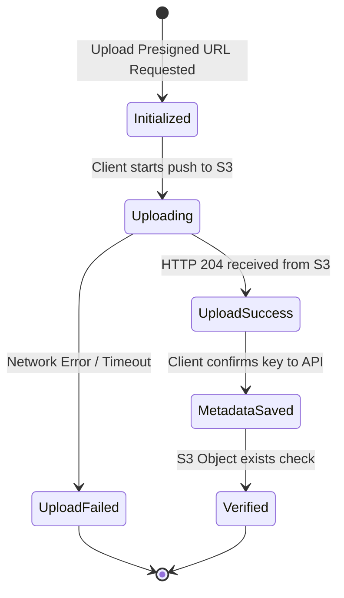

# State Diagrams Specification - EDRP

* **File Name:** `state_diagrams.md`
* **Folder Location:** `docs/diagrams/`
* **Purpose:** Define lifecycle state transitions and constraints for EDRP system entities using Mermaid.

---

## 1. Decision Record Lifecycle

---

## 2. Approval Stage Lifecycle

---

## 3. User Status Lifecycle

---

## 4. Notification Alert Lifecycle

---

## 5. Document Upload Lifecycle

