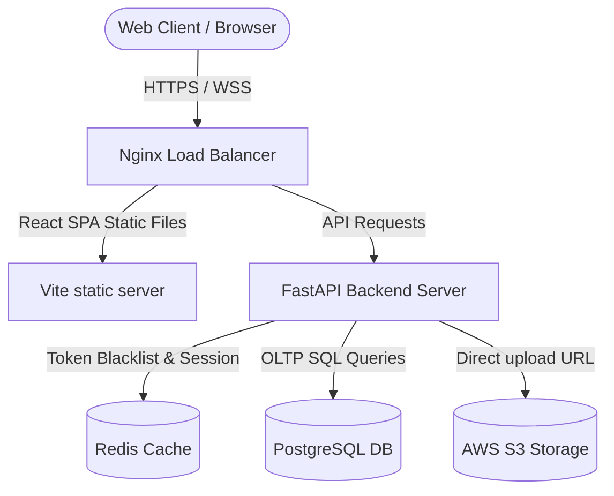
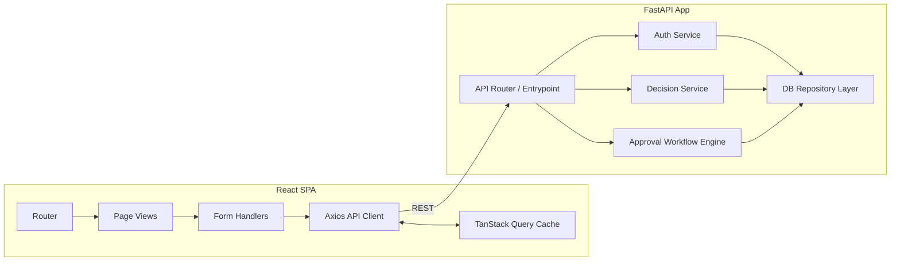
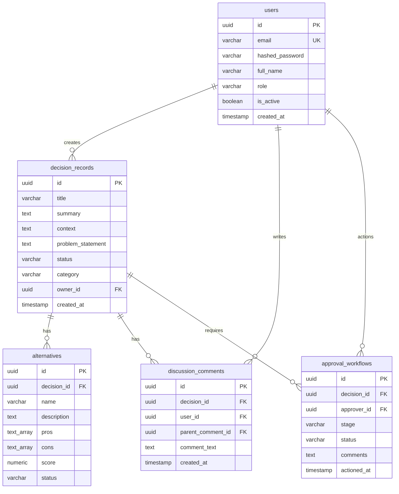
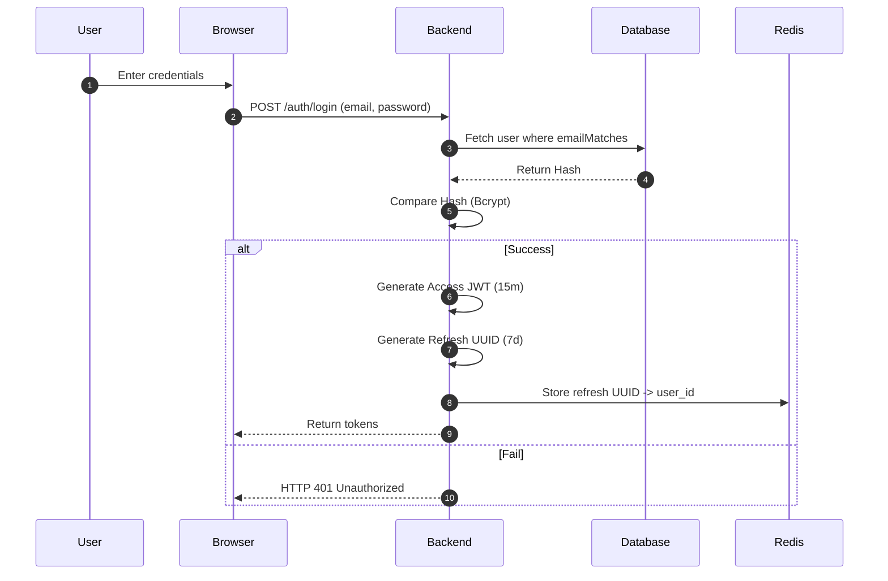
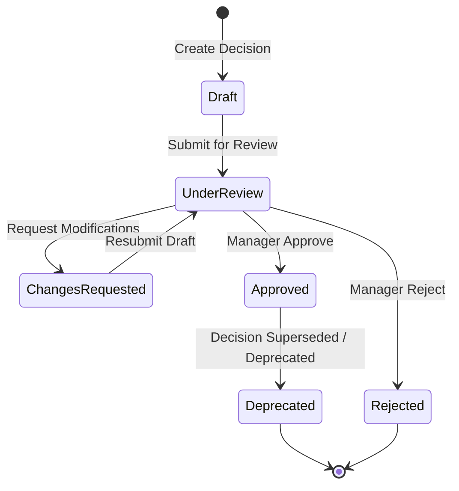
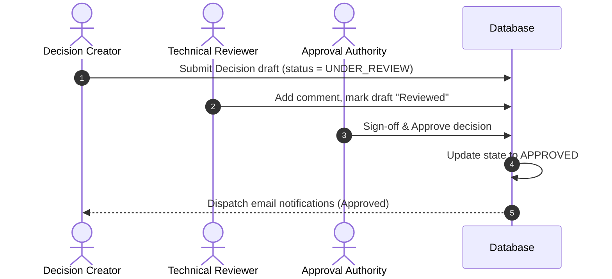
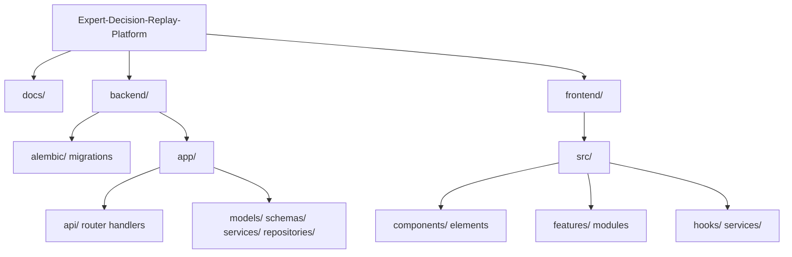

# System Diagram Compilations - EDRP

* **File Name:** `system_diagrams.md`
* **Folder Location:** `docs/diagrams/`
* **Purpose:** Consolidated Mermaid diagrams representing system components, databases, sequence flows, and lifecycles.

---

## 1. System Architecture Diagram



---

## 2. Component Diagram



---

## 3. Deployment Diagram

```mermaid
graph TD
    subgraph Client Infrastructure
        Browser[Browser Chrome/Safari]
    end
    
    subgraph Cloud Infrastructure (AWS / Docker Compose)
        NginxProxy[Nginx Container]
        FastAPIApp[FastAPI Container]
        PostgresContainer[PostgreSQL Container]
        RedisContainer[Redis Container]
        S3Bucket[AWS S3 Bucket]
    end
    
    Browser -->|Port 80/443| NginxProxy
    NginxProxy -->|Proxy Pass 8000| FastAPIApp
    FastAPIApp -->|Port 5432| PostgresContainer
    FastAPIApp -->|Port 6379| RedisContainer
    FastAPIApp -->|HTTPS / SSL| S3Bucket
```

---

## 4. Entity Relationship Diagram (ERD)



---

## 5. Authentication Flow Sequence



---

## 6. Decision Lifecycle State Machine



---

## 7. Approval Workflow Sequence Diagram



---

## 8. Folder Structure Relationship Diagram


