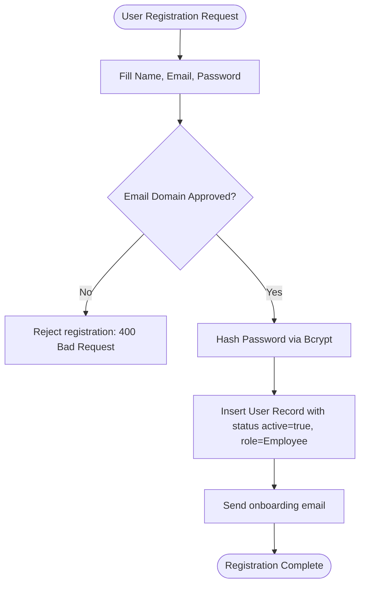
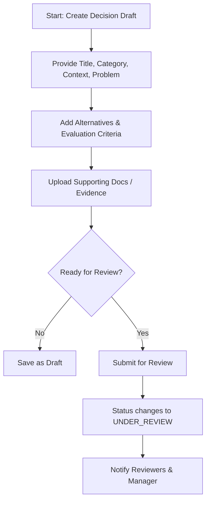
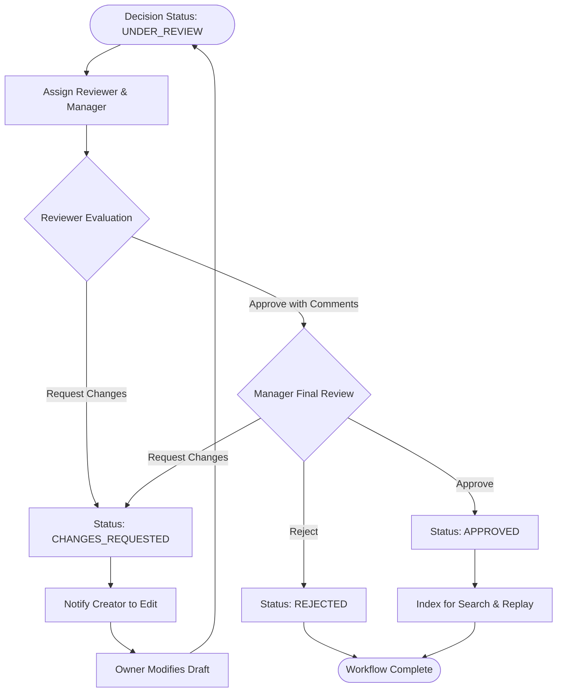
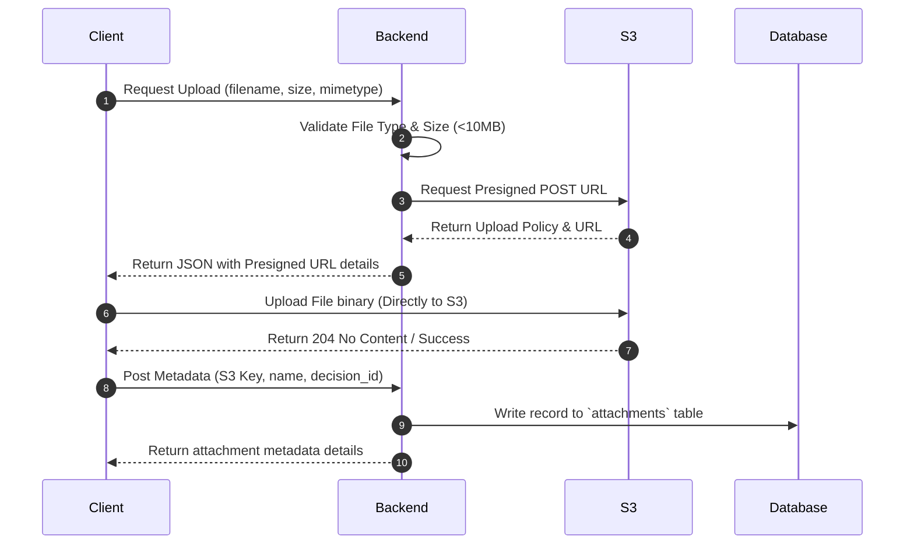

# Business Workflows & Execution Cycles - EDRP

* **File Name:** `business_workflows.md`
* **Folder Location:** `docs/workflows/`
* **Purpose:** Document primary user workflows, lifecycle states, approval sequences, notifications, and audit logging pathways.

---

## 1. User Registration & Onboarding Workflow

The registration process registers new corporate users and routes them to an Admin pending queue if verification is necessary.

1. User enters profile details. Email must match corporate domains (e.g. `@organization.com`).
2. Backend computes Bcrypt hash and writes record into database.
3. Default role is assigned as `Employee`.
4. Administrators can later promote roles to `Reviewer`, `Manager`, or `Administrator`.

---

## 2. Decision Creation & Documentation Workflow

This workflow represents the initial stages of documenting and scoping an organizational decision.

---

## 3. Review & Approval Lifecycle Workflow

This is a multi-step verification pipeline to transition a decision draft to the immutable Knowledge Repository.

---

## 4. Chronological Decision Replay Flow

"Replay" is the ability of EDRP to trace and replay historical events that led to a decision.

1. **Query:** User selects an Approved Decision and clicks the "Replay" interface.
2. **Fetch History:** Backend queries the `decision_versions` table and loads all saved snapshots in ascending order.
3. **Compare Diffs:** Frontend reads snapshots and highlights additions/deletions between versions.
4. **Visual Timeline Rendering:**
   * Step 1: Draft initiated (Author, Timestamp).
   * Step 2: Alternative matrix created.
   * Step 3: Discussion thread additions.
   * Step 4: Revision edits made due to Reviewer feedback.
   * Step 5: Final approval and digital signature (Manager, Timestamp).
   * Step 6: Post-implementation retrospect notes.

---

## 5. Attachment Upload Workflow (S3 Presigned URLs)

To optimize server resource usage, file attachments use direct client-to-S3 uploads.

---

## 6. Audit Logging Flow

An audit log records every transactional change across EDRP tables.

1. **Trigger:** A database mutation occurs (Insert, Update, Delete) via the repository layer.
2. **Capture:** The repository captures the logged-in User ID, IP address, Action type, old record JSON, and new record JSON.
3. **Write:** A write operation publishes this metadata to the `audit_logs` table.
4. **Immutability:** There are no API handlers or database procedures that permit updates or deletion operations on the `audit_logs` table (inserts only).
